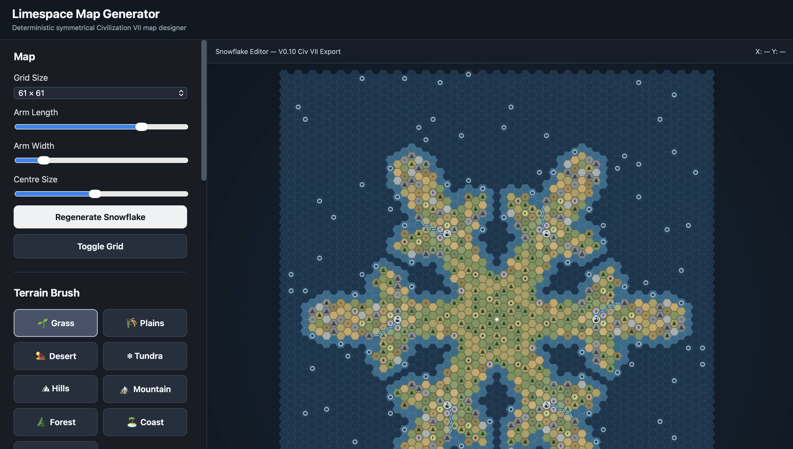
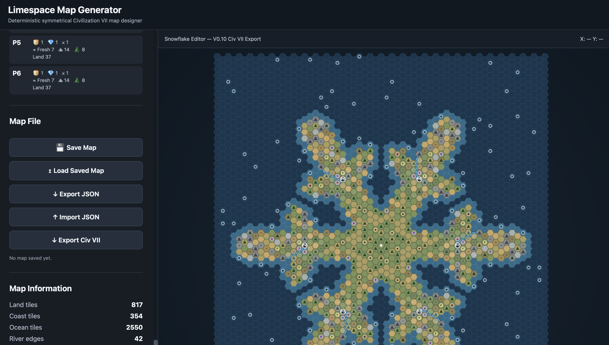

# Civ VII Map Editor

A browser-based map editor and procedural map-generation tool designed for creating custom maps for **Sid Meier's Civilization VII**.

The project began as a tool for designing the **Limespace Snowflake** map, but is being developed as a reusable editor for creating custom Civ VII map layouts.

## Live Demo

Try the editor in your browser:

https://joakim-silva.github.io/civ7-map-editor/

## Screenshots

### Map Editor



### Generated Snowflake Map



## Features

- Interactive hex-based map editor
- Terrain painting
- Grassland, plains, desert and tundra biomes
- Coast and ocean editing
- Hills and mountains
- Forest placement
- Six-way rotational symmetry
- Player start-position controls
- River generation and manual river editing
- Fresh-water visualization
- Resource-slot generation
- Food, tradeable, strategic, marine and contested resource slots
- JSON map export
- JSON map import
- Procedural Snowflake map generation

## Civ VII Integration

Maps created with the editor can be exported and converted into map data used by Civilization VII map mods.

The first playable map created with the editor is **Limespace Snowflake**, a symmetrical six-player 61×61 map.

The map mod itself is maintained separately from this editor.

## Technologies

- HTML
- CSS
- JavaScript
- JSON
- Civilization VII map scripting

## Project Structure

```text
civ7-map-editor/
├── index.html
├── style.css
├── script.js
├── screenshots/
├── README.md
└── .gitignore